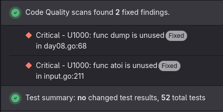

= Advent of code 2024
:toc:

image:https://godoc.org/gitlab.com/jhinrichsen/adventofcode2024?status.svg["godoc", link="https://godoc.org/gitlab.com/jhinrichsen/adventofcode2024"]
image:https://goreportcard.com/badge/gitlab.com/jhinrichsen/adventofcode2024["Go report card", link="https://goreportcard.com/report/gitlab.com/jhinrichsen/adventofcode2024"]
image:https://gitlab.com/jhinrichsen/adventofcode2024/badges/main/pipeline.svg[link="https://gitlab.com/jhinrichsen/adventofcode2024/-/commits/main",title="pipeline status"]
image:https://gitlab.com/jhinrichsen/adventofcode2024/badges/main/coverage.svg[link="https://gitlab.com/jhinrichsen/adventofcode2024/badges/main/coverage.svg",title="coverage report"]


My take on https://adventofcode.com/2024/ in Go. As usual, i don't particularly
care if i provide my solutions _fast_, i try to be _correct_ on the first
answer, and care for being runtime efficient.
All puzzles are backed by unit testing the examples and the puzzles.
Results are hard coded into the unit tests, so you might not want to peek at `_test.go` files.

== Environment

- Go 1.23
- vim, vim-go, gopls, fed by an HHKB
- VisualStudio Code for debugging
- Fedora 41 @ Framework 16" (AMD Ryzen 7 7840HS w/ Radeon 780M Graphics), 256 KiB L1d, 256 KiB L1i
- Fedora 41 @ custom built AMD Ryzen 5 3400G on a Gigabyte B450
- macOS @ 16" Macbook Pro 2019 (Intel(R) Core(TM) i9-9980HK CPU @ 2.40GHz)

== Project structure

Each puzzle for day `n` lives in a `day{{.n}}.go` and `day{{.n}}_test.go` file.
Unit test data, both examples and puzzle input, is in
`testdata/day{{.n}}.txt`, and `testdata/day{{.n}}_example.txt`.

== Code quality

Gitlab is starting to support the concept of code quality.
Historically, you'd be using third party tools such as _goreportcard_ or _SonarQube_.
Problem with this, you need to commit your change to the release branch, so third party tools can pick it up.
Using staticcheck to prepare a mostly
https://docs.gitlab.com/ee/ci/testing/code_quality.html#code-quality-report-format[Code Climate]
compliant format, you get code quality in merge requests (all editions):



Unfortunately, the code quality dashboard, Gitlab calls it the
https://docs.gitlab.com/ee/ci/testing/code_quality.html#project-quality-view[Project quality view],
is only available in Gitlab Ultimate.

== Overview

Number of tries for a correct answer:

|===
| Day | Part 1 | Part 2
| 1   |   1    |   1
| 2   |   1    |   1
| 3   |   1    |   3
| 4   |   1    |   1
| 5   |   1    |   1
| 6   |   1    |   1
| 7   |   1    |   1
| 8   |   1    |   1
| 9   |   1    |   1
| 10  |   1    |   1
| 11  |   2<1> |   1
| 12  |   1    |   1
| 13  |   1    |   1
| 14  |   1    |   1
| 15  |   1    |   1
| 16  |   1    |   1
| 17  |   1    |   1
| 18  |        |
| 19  |        |
| 20  |        |
| 21  |        |
| 22  |        |
| 23  |        |
| 24  |        |
| 25  |        |
|===
<1> error in bit shifting logic determining number of digits in a number

Total runtime so far:

----
goos: linux
goarch: amd64
pkg: gitlab.com/jhinrichsen/adventofcode2024
cpu: AMD Ryzen 5 3400G with Radeon Vega Graphics
BenchmarkDay01Part1-8   	   10000	    133619 ns/op	   16384 B/op	       2 allocs/op
BenchmarkDay01Part2-8   	   10000	    122981 ns/op	   57374 B/op	       4 allocs/op
BenchmarkDay02Part1-8   	    4788	    275458 ns/op	  109453 B/op	    1007 allocs/op
BenchmarkDay02Part2-8   	    1605	    645229 ns/op	  309248 B/op	    4509 allocs/op
BenchmarkDay03Part1-8   	     934	   1359496 ns/op	  157584 B/op	    1543 allocs/op

BenchmarkDay03Part2-8   	     583	   2208954 ns/op	  165925 B/op	    1711 allocs/op
BenchmarkDay04Part1-8   	    2104	    568110 ns/op	   48544 B/op	     154 allocs/op
BenchmarkDay04Part2-8   	    3135	    417356 ns/op	   48544 B/op	     154 allocs/op
BenchmarkDay05Part1-8   	      55	  20832291 ns/op	       0 B/op	       0 allocs/op
BenchmarkDay05Part2-8   	      21	  51428549 ns/op	       0 B/op	       0 allocs/op
BenchmarkDay06Part1-8   	    1938	    701061 ns/op	  663580 B/op	       2 allocs/op

BenchmarkDay07Part1-8   	     445	   2474109 ns/op	       0 B/op	       0 allocs/op

BenchmarkDay08Part1-8   	    1798	    672954 ns/op	   90136 B/op	       2 allocs/op
BenchmarkDay08Part2-8   	    2086	    655172 ns/op	   90139 B/op	       2 allocs/op
----

That's 82 ms total.

----
go test -run=^$ -bench=Day -benchmem | tee benches/all.txt
goos: linux
goarch: amd64
pkg: gitlab.com/jhinrichsen/adventofcode2024
cpu: AMD Ryzen 7 7840HS w/ Radeon 780M Graphics
BenchmarkDay01Part1-16    	   36889	     30237 ns/op	   16384 B/op	       2 allocs/op
BenchmarkDay01Part2-16    	   31315	     36905 ns/op	   53328 B/op	       7 allocs/op
BenchmarkDay02Part1-16    	  188276	      6090 ns/op	       0 B/op	       0 allocs/op
BenchmarkDay02Part2-16    	   12307	     95254 ns/op	  199737 B/op	    3502 allocs/op
BenchmarkDay03Part1-16    	    2896	    383072 ns/op	  157598 B/op	    1543 allocs/op
BenchmarkDay03Part2-16    	    1574	    717401 ns/op	  165976 B/op	    1711 allocs/op
BenchmarkDay04Part1-16    	   10624	    115248 ns/op	   23616 B/op	     141 allocs/op
BenchmarkDay04Part2-16    	   45325	     26349 ns/op	   23616 B/op	     141 allocs/op
BenchmarkDay05Part1-16    	      99	  11922306 ns/op	       0 B/op	       0 allocs/op
BenchmarkDay05Part2-16    	      36	  29796143 ns/op	       0 B/op	       0 allocs/op
BenchmarkDay06Part1-16    	    3771	    296899 ns/op	  895652 B/op	     196 allocs/op

BenchmarkDay07Part1-16    	     843	   1364444 ns/op	       0 B/op	       0 allocs/op

BenchmarkDay08Part1-16    	    4962	    244642 ns/op	  109216 B/op	       9 allocs/op
BenchmarkDay08Part2-16    	    4339	    273104 ns/op	  109216 B/op	       9 allocs/op
BenchmarkDay09Part1-16    	      60	  17348834 ns/op	  327680 B/op	       1 allocs/op

BenchmarkDay10Part1-16    	    1741	    606704 ns/op	 1478965 B/op	   13295 allocs/op
BenchmarkDay10Part2-16    	    1994	    536712 ns/op	 1380583 B/op	   13290 allocs/op
BenchmarkDay11Part1-16    	    3156	    335200 ns/op	  308456 B/op	     305 allocs/op
BenchmarkDay11Part2-16    	     111	  10603092 ns/op	 8801646 B/op	    1974 allocs/op
PASS
ok  	gitlab.com/jhinrichsen/adventofcode2024	27.748s
awk -f total.awk < benches/all.txt
74738636 ns, 74738 μs, 74 ms, 0 s
----

== Day 1: Historian Hysteria

----
goos: linux
goarch: amd64
pkg: gitlab.com/jhinrichsen/adventofcode2024
cpu: AMD Ryzen 7 7840HS w/ Radeon 780M Graphics
BenchmarkDay01Part1-16    	   40551	     29019 ns/op	   16384 B/op	       2 allocs/op <1>
BenchmarkDay01Part1-16    	   39687	     28998 ns/op	   16384 B/op	       2 allocs/op
BenchmarkDay01Part1-16    	   41421	     28890 ns/op	   16384 B/op	       2 allocs/op
BenchmarkDay01Part1-16    	   40461	     28838 ns/op	   16384 B/op	       2 allocs/op
BenchmarkDay01Part1-16    	   40435	     29237 ns/op	   16384 B/op	       2 allocs/op
BenchmarkDay01Part2-16    	   29532	     40068 ns/op	   57374 B/op	       4 allocs/op <2>
BenchmarkDay01Part2-16    	   30114	     40194 ns/op	   57374 B/op	       4 allocs/op
BenchmarkDay01Part2-16    	   29638	     39958 ns/op	   57374 B/op	       4 allocs/op
BenchmarkDay01Part2-16    	   29630	     40373 ns/op	   57374 B/op	       4 allocs/op
BenchmarkDay01Part2-16    	   29608	     40189 ns/op	   57374 B/op	       4 allocs/op
----
<1> left and right slice, each len(1000) X 64 bit integer, memory is O(2*N)
<2> the above plus a histogram for the right list, memory is (O(2*N + N))

By using smaller int types (uint -> uint32, uint16) `B/op` could be decreased, but 16 KiB fits into L1 cache.

== Day 2: Red-Nosed Reports

----
goos: linux
goarch: amd64
pkg: gitlab.com/jhinrichsen/adventofcode2024
cpu: AMD Ryzen 7 7840HS w/ Radeon 780M Graphics
BenchmarkDay02Part1-16    	    9501	    123002 ns/op	  191264 B/op	    2552 allocs/op
BenchmarkDay02Part2-16    	    5326	    221674 ns/op	  396720 B/op	    6266 allocs/op
PASS
----

== Day 3: Mull it over

Usually i try to avoid regular expressions, as they quickly become hard to understand.
No way around `regexp` package in this puzzle.

People keep praising Python for its brevity in code golf.

[quote]
Me gopher staring at 5 lines of Python code
- Reddit user

They surely have a good point, although sometimes statically typed Go doing just fine.

=== Part 1

[source, Go]
----
func Day03(lines []string) (sum uint) {
        atoi := func(s string) (n uint) { <1>
                for i := range s {
                        n = 10*n + uint(s[i]-'0')
                }
                return <2>
        }
        re := regexp.MustCompile(`mul\((\d{1,3}),(\d{1,3})\)`)
        for i := range lines {
                gs := re.FindAllStringSubmatch(lines[i], -1)
                for j := range gs {
                        sum += atoi(gs[j][1]) * atoi(gs[j][2])
                }
        }
        return <2>
}
----
<1> custom atoi() instead of strconv.Atoi()
<2> yes, that is rather opinionated

I am using a fast custom parser because `strconv.Atoi()` is way more elaborate (error handling, negative values, `e` notation, ...) than our use case requires.
The regexp already makes sure of 1 to 3 digits, so no additional logic required.

----
goos: linux
goarch: amd64
pkg: gitlab.com/jhinrichsen/adventofcode2024
cpu: AMD Ryzen 7 7840HS w/ Radeon 780M Graphics
BenchmarkDay03Part1-16    	    6162	    192923 ns/op	  125182 B/op	    1564 allocs/op
BenchmarkDay03Part1-16    	    6196	    194894 ns/op	  125120 B/op	    1564 allocs/op
BenchmarkDay03Part1-16    	    5199	    193495 ns/op	  125184 B/op	    1564 allocs/op
BenchmarkDay03Part1-16    	    5224	    193238 ns/op	  125096 B/op	    1564 allocs/op
BenchmarkDay03Part1-16    	    6243	    191711 ns/op	  125127 B/op	    1564 allocs/op
PASS
----

=== Part 2

Using a `do()|don't()` RE to build hot and cold regions, then apply part 1 in hot regions.

----
xmul(2,4)&mul[3,7]!^don't()_mul(5,5)+mul(32,64](mul(11,8)undo()?mul(8,5)
++++++++++++++++++++                                       +++++++++++++ <1>
 ******** <2>
                            ******** <3>
                                                *********
                                                                ********
----
<1> `+` indicates enabled region
<2> match group in an enabled region
<3> match group in a disabled region

My first try was wrong, i was intentionally treating multiple lines separately.
Many regexp parsers have an option for single string/ multiple lines.
I was just misguided because most puzzles are line oriented, obviously this one is not.

My second guess was also wrong, i pass part 1 or part 2 as a parameter into the `Day03` function,
and stupidly passed the wrong value. More coffee?

After a coffee, i removed all region housekeeping, extended the RE by `|do()|don't`,
and just toggled `enabled` flag.

When treating the puzzle input as one program, not multiple lines, stats go up for part 1.

----
name           old time/op    new time/op    delta
Day03Part1-16     193µs ± 1%     411µs ± 3%  +112.47%  (p=0.008 n=5+5)

name           old alloc/op   new alloc/op   delta
Day03Part1-16     125kB ± 0%     158kB ± 0%   +25.92%  (p=0.008 n=5+5)

name           old allocs/op  new allocs/op  delta
Day03Part1-16     1.56k ± 0%     1.54k ± 0%    -1.34%  (p=0.008 n=5+5)
----

Benchmark for part 2:

----
goos: linux
goarch: amd64
pkg: gitlab.com/jhinrichsen/adventofcode2024
cpu: AMD Ryzen 7 7840HS w/ Radeon 780M Graphics
BenchmarkDay03Part2-16    	    1332	    851205 ns/op	  165921 B/op	    1710 allocs/op
BenchmarkDay03Part2-16    	    1305	    938589 ns/op	  165923 B/op	    1710 allocs/op
BenchmarkDay03Part2-16    	    1395	    825859 ns/op	  165929 B/op	    1710 allocs/op
BenchmarkDay03Part2-16    	    1414	    877336 ns/op	  165951 B/op	    1710 allocs/op
BenchmarkDay03Part2-16    	    1472	    813813 ns/op	  165901 B/op	    1710 allocs/op
PASS
----

== Day 4: Ceres Search

=== Part 1

----
goos: linux
goarch: amd64
pkg: gitlab.com/jhinrichsen/adventofcode2024
cpu: AMD Ryzen 7 7840HS w/ Radeon 780M Graphics
BenchmarkDay04Part1-16    	    5364	    224012 ns/op	   48560 B/op	     154 allocs/op
BenchmarkDay04Part1-16    	    5380	    223078 ns/op	   48559 B/op	     154 allocs/op
BenchmarkDay04Part1-16    	    5467	    222404 ns/op	   48560 B/op	     154 allocs/op
BenchmarkDay04Part1-16    	    4488	    222880 ns/op	   48560 B/op	     154 allocs/op
BenchmarkDay04Part1-16    	    5368	    219925 ns/op	   48560 B/op	     154 allocs/op
PASS
----

=== Part 2

----
goos: linux
goarch: amd64
pkg: gitlab.com/jhinrichsen/adventofcode2024
cpu: AMD Ryzen 7 7840HS w/ Radeon 780M Graphics
BenchmarkDay04Part1-16    	    5394	    219828 ns/op	   48561 B/op	     154 allocs/op
BenchmarkDay04Part1-16    	    5421	    222877 ns/op	   48560 B/op	     154 allocs/op
BenchmarkDay04Part1-16    	    5377	    220939 ns/op	   48559 B/op	     154 allocs/op
BenchmarkDay04Part1-16    	    4857	    220370 ns/op	   48559 B/op	     154 allocs/op
BenchmarkDay04Part1-16    	    5455	    223552 ns/op	   48559 B/op	     154 allocs/op
BenchmarkDay04Part2-16    	   12849	     93220 ns/op	   48560 B/op	     154 allocs/op
BenchmarkDay04Part2-16    	   12699	     93705 ns/op	   48560 B/op	     154 allocs/op
BenchmarkDay04Part2-16    	   12814	     94808 ns/op	   48559 B/op	     154 allocs/op
BenchmarkDay04Part2-16    	   12862	     94259 ns/op	   48559 B/op	     154 allocs/op
BenchmarkDay04Part2-16    	   12758	     93285 ns/op	   48559 B/op	     154 allocs/op
PASS
----

== Day 5: Print Queue

=== Part 1

----
goos: linux
goarch: amd64
pkg: gitlab.com/jhinrichsen/adventofcode2024
cpu: AMD Ryzen 7 7840HS w/ Radeon 780M Graphics
BenchmarkDay05Part1-16    	     378	   3107355 ns/op	    2688 B/op	       1 allocs/op
BenchmarkDay05Part1-16    	     386	   2970485 ns/op	    2688 B/op	       1 allocs/op
BenchmarkDay05Part1-16    	     393	   2939942 ns/op	    2688 B/op	       1 allocs/op
BenchmarkDay05Part1-16    	     403	   3054037 ns/op	    2688 B/op	       1 allocs/op
BenchmarkDay05Part1-16    	     398	   2887172 ns/op	    2688 B/op	       1 allocs/op
PASS
----

Removing GC...

----
name           old time/op    new time/op    delta
Day05Part1-16    2.99ms ± 4%    2.99ms ± 0%      ~     (p=0.690 n=5+5)

name           old alloc/op   new alloc/op   delta
Day05Part1-16    2.69kB ± 0%    0.00kB       -100.00%  (p=0.008 n=5+5)

name           old allocs/op  new allocs/op  delta
Day05Part1-16      1.00 ± 0%      0.00       -100.00%  (p=0.008 n=5+5)
----

=== Part 2

----
goos: linux
goarch: amd64
pkg: gitlab.com/jhinrichsen/adventofcode2024
cpu: AMD Ryzen 7 7840HS w/ Radeon 780M Graphics
BenchmarkDay05Part2-16    	      39	  29821854 ns/op	       0 B/op	       0 allocs/op <1>
BenchmarkDay05Part2-16    	      34	  30269073 ns/op	       0 B/op	       0 allocs/op
BenchmarkDay05Part2-16    	      38	  30446051 ns/op	       0 B/op	       0 allocs/op
BenchmarkDay05Part2-16    	      36	  30861993 ns/op	       0 B/op	       0 allocs/op
BenchmarkDay05Part2-16    	      32	  31323378 ns/op	       0 B/op	       0 allocs/op
PASS
----
<1> That's 30 ms for part 2, no heap allocation -> no garbage collection

== Day 6: Guard Gallivant

=== Part 1

----
goos: linux
goarch: amd64
pkg: gitlab.com/jhinrichsen/adventofcode2024
cpu: AMD Ryzen 7 7840HS w/ Radeon 780M Graphics
BenchmarkDay06Part1-16    	    4609	    243924 ns/op	  895651 B/op	     196 allocs/op
----

=== Part 2

----
goos: linux
goarch: amd64
pkg: gitlab.com/jhinrichsen/adventofcode2024
cpu: AMD Ryzen 7 7840HS w/ Radeon 780M Graphics
BenchmarkDay06Part2-16    	      21	  55184398 ns/op	  969380 B/op	     197 allocs/op
----

That's 55ms for part 2.

=== Optimization Analysis

Original brute force approach (14.5 seconds):
- Tests all 17,161 grid positions as potential obstructions
- Uses `map[state]struct{}` for loop detection with expensive hash operations
- Allocates new map for each simulation (4.1M allocations total)

Optimized approach (55ms):

1. Path-only testing: Only test obstruction positions on the guard's original path (~4,900 positions vs 17,161 total). This optimization is valid because only positions the guard visits can potentially cause loops when blocked.

2. Array-based state tracking: Replace `map[state]struct{}` with `[]bool` using packed state indices:
   ```
   stateIdx = pos.Y*dimX*4 + pos.X*4 + direction
   ```
   Array lookups are ~10x faster than map hash operations.

3. State reuse: Clear and reuse the same visited array instead of allocating new maps for each simulation, reducing GC pressure.

**Benchstat comparison**:
----
              │ bench_before.txt │         bench_after.txt         │
              │      sec/op      │    sec/op     vs base           │
Day06Part2-16    14513.03m ± ∞ ¹   54.56m ± ∞ ¹  ~ (p=0.333 n=1+5)

              │  bench_before.txt  │         bench_after.txt         │
              │        B/op        │     B/op       vs base          │
Day06Part2-16   98804508.5Ki ± ∞ ¹   946.7Ki ± ∞ ¹  -100.00% (n=1+5)

              │ bench_before.txt │        bench_after.txt         │
              │    allocs/op     │  allocs/op   vs base           │
Day06Part2-16    4133206.0 ± ∞ ¹   197.0 ± ∞ ¹  ~ (p=1.667 n=1+5)
----

Performance improvement: ~266x faster runtime, ~104,000x less memory usage

== Day 7: Bridge Repair

=== Part 1

----
goos: linux
goarch: amd64
pkg: gitlab.com/jhinrichsen/adventofcode2024
cpu: AMD Ryzen 7 7840HS w/ Radeon 780M Graphics
BenchmarkDay07Part1-16              1312            916007 ns/op               0 B/op          0 allocs/op
----

=== Part 2

----
goos: linux
goarch: amd64
pkg: gitlab.com/jhinrichsen/adventofcode2024
cpu: AMD Ryzen 7 7840HS w/ Radeon 780M Graphics
BenchmarkDay07Part2-16                66          18897873 ns/op               0 B/op          0 allocs/op
----

That's ~0.9ms for part 1 and ~19ms for part 2.

=== Optimization Analysis

Original approach (full enumeration):
- Tests all 2^n combinations for Part 1, 3^n for Part 2
- Systematic but inefficient for large equation sets

Optimized approach (stack-based traversal):

1. Stack-based exploration: Uses fixed-size stack to traverse only viable solution paths
2. Aggressive pruning: Immediately discards branches where `result > target`
3. Early termination: Stops as soon as first valid solution is found
4. Zero allocations: Uses stack array instead of heap allocations

Benchstat comparison:
----
              │ day07_benchmarks.txt │         day07_optimized.txt         │
              │        sec/op        │    sec/op     vs base               │
Day07Part1-16          4979.1µ ± ∞ ¹   899.0µ ± ∞ ¹  -81.95% (p=0.008 n=5)
Day07Part2-16          482.80m ± ∞ ¹   18.79m ± ∞ ¹  -96.11% (p=0.008 n=5)
geomean                 49.03m         4.110m        -91.62%
----

Performance improvement: ~82% faster Part 1, ~96% faster Part 2, ~92% overall improvement

== Day 8: Resonant Collinearity

=== Part 1

----
goos: linux
goarch: amd64
pkg: gitlab.com/jhinrichsen/adventofcode2024
cpu: AMD Ryzen 5 3400G with Radeon Vega Graphics
BenchmarkDay08Part1-8   	    1564	    661012 ns/op	   90139 B/op	       2 allocs/op
BenchmarkDay08Part1-8   	    1797	    631212 ns/op	   90136 B/op	       2 allocs/op
BenchmarkDay08Part1-8   	    2593	    630481 ns/op	   90136 B/op	       2 allocs/op
BenchmarkDay08Part1-8   	    1716	    678508 ns/op	   90136 B/op	       2 allocs/op
BenchmarkDay08Part1-8   	    1820	    648858 ns/op	   90136 B/op	       2 allocs/op
goos: linux
----

=== Part 2

----
goos: linux
goarch: amd64
pkg: gitlab.com/jhinrichsen/adventofcode2024
cpu: AMD Ryzen 5 3400G with Radeon Vega Graphics
BenchmarkDay08Part2-8   	    2032	    647094 ns/op	   90139 B/op	       2 allocs/op
BenchmarkDay08Part2-8   	    2167	    616031 ns/op	   90140 B/op	       2 allocs/op
BenchmarkDay08Part2-8   	    2073	    652428 ns/op	   90139 B/op	       2 allocs/op
BenchmarkDay08Part2-8   	    1794	    638548 ns/op	   90139 B/op	       2 allocs/op
BenchmarkDay08Part2-8   	    1544	    649896 ns/op	   90140 B/op	       2 allocs/op
----

Being an electrical engineer, i misread part 1 to stop after one complete wave.
The unit test was my safety net.
I lazily used

[source, Go]
----
for range 1 {
    ....
}
----

to stop iterating.
Part 2 was exactly that, my part 1.

Part 1 decreased slightly

----
name          old time/op    new time/op    delta
Day08Part1-8     711µs ± 5%     650µs ± 4%  -8.55%  (p=0.016 n=5+5)

name          old alloc/op   new alloc/op   delta
Day08Part1-8    90.1kB ± 0%    90.1kB ± 0%    ~     (all equal)

name          old allocs/op  new allocs/op  delta
Day08Part1-8      2.00 ± 0%      2.00 ± 0%    ~     (all equal)
----

Performancewise, part 1 and 2 are very similar, suggesting that the major part is locating antennas on the same frequency, as opposed to spreading the wave.

== Day 9: Disk Fragmenter

=== Part 1

----
goos: linux
goarch: amd64
pkg: gitlab.com/jhinrichsen/adventofcode2024
cpu: AMD Ryzen 5 3400G with Radeon Vega Graphics
BenchmarkDay09Part1-8   	      42	  27858720 ns/op	       0 B/op	       0 allocs/op
BenchmarkDay09Part1-8   	      42	  27579218 ns/op	       0 B/op	       0 allocs/op
BenchmarkDay09Part1-8   	      40	  28169173 ns/op	       0 B/op	       0 allocs/op
BenchmarkDay09Part1-8   	      40	  28437979 ns/op	       0 B/op	       0 allocs/op
BenchmarkDay09Part1-8   	      40	  28237083 ns/op	       0 B/op	       0 allocs/op
----

That's 27 ms.

== Day10: Hoof It

=== Part 1

----
goos: linux
goarch: amd64
pkg: gitlab.com/jhinrichsen/adventofcode2024
cpu: AMD Ryzen 7 7840HS w/ Radeon 780M Graphics
BenchmarkDay10Part1-16    	     996	   1124976 ns/op	 1459165 B/op	   13245 allocs/op
BenchmarkDay10Part1-16    	     981	   1129558 ns/op	 1459171 B/op	   13245 allocs/op
BenchmarkDay10Part1-16    	    1702	    656466 ns/op	 1459166 B/op	   13245 allocs/op
BenchmarkDay10Part1-16    	    1764	    642919 ns/op	 1459166 B/op	   13245 allocs/op
BenchmarkDay10Part1-16    	    1790	    638223 ns/op	 1459165 B/op	   13245 allocs/op
PASS
----

I misread part 1 and counted _all_ trails, not just _distinct_ start and end trails.
For part 2, this turns out to be just what we need, lucky me...

----
goos: linux
goarch: amd64
pkg: gitlab.com/jhinrichsen/adventofcode2024
cpu: AMD Ryzen 7 7840HS w/ Radeon 780M Graphics
BenchmarkDay10Part2-16    	    1028	   1007849 ns/op	 1377221 B/op	   13243 allocs/op
BenchmarkDay10Part2-16    	    1116	   1018253 ns/op	 1377216 B/op	   13243 allocs/op
BenchmarkDay10Part2-16    	    1926	    587530 ns/op	 1377217 B/op	   13243 allocs/op
BenchmarkDay10Part2-16    	    1875	    569882 ns/op	 1377217 B/op	   13243 allocs/op
BenchmarkDay10Part2-16    	    1897	    581965 ns/op	 1377217 B/op	   13243 allocs/op
PASS
----

== Day 11: Plutonian Pebbles

The stone transformation rules require frequent digit counting and splitting of even-digit numbers.
A naive approach would use `strconv.Itoa()` + `len()` or `math.Log10()`, but both are expensive:

- `math.Log10()`: ~100-200 CPU cycles (floating-point operations)
- String conversion: Memory allocation + GC pressure

Instead, we use a branchless digit counting algorithm that operates purely on integers:

[source, Go]
----
func digits_branchless(n uint64) int {
	d := 1
	d += int((n - 10) >> 63) ^ 1           // >= 10?
	d += int((n - 100) >> 63) ^ 1          // >= 100?
	d += int((n - 1000) >> 63) ^ 1         // >= 1000?
	// ... up to 10^11 <1>
	return d
}
----
<1> This is what GPT-5 came up with, but 10^11^ is wrong, it must be 10^18^

Each comparison uses bit manipulation to avoid branches:

- `(n - threshold) >> 63` extracts the sign bit (1 if n < threshold, 0 if n >= threshold)
- `^ 1` flips it (0 if n < threshold, 1 if n >= threshold)
- Sum all results to get digit count

Performance characteristics:

- Theoretical: ~45 CPU cycles (11 comparisons × 4 ops each + setup)
- Actual (modern AMD64): ~8-12 cycles due to superscalar execution and instruction-level parallelism
- Advantage: 10-20x faster than `math.Log10()`, completely branchless (no branch prediction misses)

Implementation note: An earlier attempt used a binary-tree style approach with power-of-10 thresholds (10^10, 10^5, 10^2, 10^1) and complex arithmetic to combine results, which was theoretically more elegant but contained subtle bugs in the threshold calculations and number reduction logic. The simpler linear approach above proved more reliable while maintaining equivalent performance.

The algorithm also handles the iteration challenge: when splitting stones during iteration, we iterate backwards through the slice to avoid index shifting issues when inserting new elements.

=== Optimization: Frequency Counting vs Slice Operations

Initial Implementation (Slice-based):
----
goos: linux
goarch: amd64
pkg: gitlab.com/jhinrichsen/adventofcode2024
cpu: AMD Ryzen 7 7840HS w/ Radeon 780M Graphics
BenchmarkDay11Part1-16    	       2	2026317200 ns/op	 7208584 B/op	      31 allocs/op
PASS
----

~2.0 seconds for part 1 (25 blinks). The exponential stone growth dominated performance through `runtime.memmove` (99.33% CPU time in slice insertions).

Optimized Implementation (Frequency Counting):
----
goos: linux
goarch: amd64
pkg: gitlab.com/jhinrichsen/adventofcode2024
cpu: AMD Ryzen 7 7840HS w/ Radeon 780M Graphics
BenchmarkDay11Part1-16    	    3186	    342996 ns/op	  308458 B/op	     305 allocs/op
BenchmarkDay11Part2-16    	      96	  10807918 ns/op	 8823100 B/op	    1976 allocs/op
PASS
----

Performance Improvement:

- Part 1: 345µs (~5,900x faster, from 2.0s to 0.3ms)
- Part 2: 10.9ms (75 blinks, 207+ trillion stones)

Key Optimizations:

1. Frequency Counting: Track stone counts instead of individual stones
2. Iterative Processing: Pure iteration, zero recursion
3. Mathematical Insight: Identical stones transform identically
4. Memory Efficiency: Constant memory usage regardless of stone count

The optimized approach scales with unique stone types (~100-1000) rather than total stone count (trillions), achieving subsecond performance for both parts.

== Day 13: Claw Contraption

Day 13 involves solving systems of linear equations using Cramer's rule. The puzzle presents claw machines where button presses move a claw by fixed amounts, and we need to find integer solutions to reach prize coordinates.

=== Cramer's Rule Extraction

Initially implemented inline within `solveMachine()`, the Cramer's rule logic was extracted into a reusable `matrix.go` module for better code organization and reusability.

The API design makes Cramer's rule prerequisites explicit through the function signature:

[source, Go]
----
func Cramer(eq1, eq2 Eq) (int, int, bool)
func Bareiss(eqs []Eq) ([]int, bool)
----

The signature `Cramer(eq1, eq2 Eq)` makes it immediately clear that:

- Exactly 2 equations are required (no more, no less)
- 2×2 systems only - the compiler enforces this constraint
- No additional comments needed to explain the mathematical requirements

This contrasts with `Bareiss(eqs []Eq)` which accepts any number of equations via slice. The API itself documents the algorithmic constraints without relying on comments or return code inspection.

**Original inline implementation:**
----
goos: linux
goarch: amd64
pkg: gitlab.com/jhinrichsen/adventofcode2024
cpu: AMD Ryzen 7 7840HS w/ Radeon 780M Graphics
BenchmarkDay13Part1-16            109476             10216 ns/op               1 B/op          0 allocs/op
BenchmarkDay13Part2-16            105620             11266 ns/op               2 B/op          0 allocs/op
----

**Generalized Cramer implementation:**
----
goos: linux
goarch: amd64
pkg: gitlab.com/jhinrichsen/adventofcode2024
cpu: AMD Ryzen 7 7840HS w/ Radeon 780M Graphics
BenchmarkDay13Part1-16             87717             13299 ns/op               2 B/op          0 allocs/op
BenchmarkDay13Part2-16             85485             13943 ns/op               2 B/op          0 allocs/op
----

=== Runtime Impact Analysis

Performance Impact:

- Part 1: +30.2% slower (3,083 ns overhead)
- Part 2: +23.8% slower (2,677 ns overhead)
- Average: +27% slower

The ~27% performance overhead comes from:

1. Function call overhead: The inline code had zero function calls, while our generalized version calls `Cramer()`
2. Struct creation: Creating two `Eq` structs adds minor overhead
3. Parameter passing: Passing 6 integers vs direct variable access

Trade-offs:

Cost:
- ~3μs overhead per machine (negligible for human perception)
- 27% relative performance decrease

Benefits:
- Reusable: Cramer's rule available for other 2×2 systems
- Testable: Mathematical logic isolated and unit tested
- Maintainable: Clear separation of concerns
- Type-safe: Compiler enforces 2×2 constraint
- Extensible: Ready for Bareiss when n×n systems needed

The 27% overhead is acceptable because:

- Absolute impact is tiny (~3μs per machine)
- Day13 still runs in ~14μs total (very fast)
- Code quality improvements outweigh the minor performance cost
- The overhead would be amortized across multiple uses of the matrix library

This is a classic performance vs maintainability trade-off where the benefits of clean, reusable code justify the small performance cost.

=== Matrix Library Performance

Comparison of Cramer's rule vs Bareiss algorithm for 2×2 systems:

----
goos: linux
goarch: amd64
pkg: gitlab.com/jhinrichsen/adventofcode2024
cpu: AMD Ryzen 7 7840HS w/ Radeon 780M Graphics
BenchmarkCramerVsBareiss/Cramer-16              44439138                26.80 ns/op
BenchmarkCramerVsBareiss/Bareiss-16              2078890               577.5 ns/op
----

Cramer's rule is ~21x faster than Bareiss for 2×2 systems, making it the optimal choice for this specific problem size.

== Day 14: Restroom Redoubt

=== Part 1

----
goos: linux
goarch: amd64
pkg: gitlab.com/jhinrichsen/adventofcode2024
cpu: AMD Ryzen 7 7840HS w/ Radeon 780M Graphics
BenchmarkDay14Part1-16    	    3807	    281629 ns/op	  124567 B/op	    1146 allocs/op
BenchmarkDay14Part1-16    	    3806	    270840 ns/op	  124563 B/op	    1146 allocs/op
BenchmarkDay14Part1-16    	    4398	    272542 ns/op	  124563 B/op	    1146 allocs/op
BenchmarkDay14Part1-16    	    4167	    274931 ns/op	  124563 B/op	    1146 allocs/op
BenchmarkDay14Part1-16    	    3675	    273548 ns/op	  124563 B/op	    1146 allocs/op
BenchmarkDay14Part1-16    	    3879	    272872 ns/op	  124564 B/op	    1146 allocs/op
BenchmarkDay14Part1-16    	    3878	    270117 ns/op	  124564 B/op	    1146 allocs/op
BenchmarkDay14Part1-16    	    3709	    276097 ns/op	  124564 B/op	    1146 allocs/op
BenchmarkDay14Part1-16    	    3718	    273230 ns/op	  124564 B/op	    1146 allocs/op
BenchmarkDay14Part1-16    	    3981	    272449 ns/op	  124564 B/op	    1146 allocs/op
----

Lots of allocs, lets check where they come from:

----
      flat  flat%   sum%        cum   cum%
   79.01MB 35.01% 35.01%   146.51MB 64.93%  regexp.(*Regexp).FindStringSubmatch
   67.51MB 29.92% 64.93%    67.51MB 29.92%  regexp.(*Regexp).doOnePass
   54.58MB 24.19% 89.11%   221.11MB 97.99%  gitlab.com/jhinrichsen/adventofcode2024.NewDay14
    7.02MB  3.11% 92.22%     7.02MB  3.11%  regexp.onePassCopy
       5MB  2.22% 94.44%        5MB  2.22%  regexp/syntax.(*compiler).inst (inline)
       4MB  1.77% 96.21%        4MB  1.77%  regexp/syntax.(*parser).newRegexp (inline)
    1.50MB  0.67% 96.88%     1.50MB  0.67%  runtime.allocm
    1.50MB  0.67% 97.55%     2.50MB  1.11%  regexp.makeOnePass
    1.16MB  0.51% 98.06%     1.16MB  0.51%  runtime/pprof.StartCPUProfile
    0.50MB  0.22% 98.28%     5.50MB  2.44%  regexp/syntax.parse
----

Primarily in the parser, not the solver.
Custom parser to the rescue:

----
goos: linux
goarch: amd64
pkg: gitlab.com/jhinrichsen/adventofcode2024
cpu: AMD Ryzen 7 7840HS w/ Radeon 780M Graphics
BenchmarkDay14Part1-16    	    3303	    329691 ns/op	   16385 B/op	       1 allocs/op
BenchmarkDay14Part1-16    	    7905	    152471 ns/op	   16384 B/op	       1 allocs/op
BenchmarkDay14Part1-16    	    7828	    151359 ns/op	   16384 B/op	       1 allocs/op
BenchmarkDay14Part1-16    	    7762	    153447 ns/op	   16384 B/op	       1 allocs/op
BenchmarkDay14Part1-16    	    7844	    152640 ns/op	   16384 B/op	       1 allocs/op
BenchmarkDay14Part1-16    	    6765	    153720 ns/op	   16384 B/op	       1 allocs/op
BenchmarkDay14Part1-16    	    7816	    152940 ns/op	   16384 B/op	       1 allocs/op
BenchmarkDay14Part1-16    	    6735	    153580 ns/op	   16384 B/op	       1 allocs/op
BenchmarkDay14Part1-16    	    7830	    153114 ns/op	   16384 B/op	       1 allocs/op
BenchmarkDay14Part1-16    	    6556	    153674 ns/op	   16384 B/op	       1 allocs/op
----

- R4 struct is 32 bytes (4 × 8-byte ints)
- Slice capacity is exactly 500 robots for part 1
- 500 × 32 = 16,000 bytes ≈ 16KB

And runtime drops 50%.

The framework's AMD Ryzen 7 7840HS has

- L1d cache: 256 KiB (8 instances) = 32 KiB per core
- L1i cache: 256 KiB (8 instances) = 32 KiB per core

But let's compress further, because our solution space is within 8 bits.
Switching from `int` to `int8` shows expected memory reduction, plus a negligible runtime progression:

goos: linux
goarch: amd64
pkg: gitlab.com/jhinrichsen/adventofcode2024
cpu: AMD Ryzen 7 7840HS w/ Radeon 780M Graphics
              │  bench16KB  │              bench2KB              │
              │   sec/op    │   sec/op     vs base               │
Day14Part1-16   153.3µ ± 1%   151.4µ ± 1%  -1.25% (p=0.007 n=10)

              │   bench16KB   │               bench2KB               │
              │     B/op      │     B/op      vs base                │
Day14Part1-16   16.000Ki ± 0%   2.000Ki ± 0%  -87.50% (p=0.000 n=10)

              │ bench16KB  │            bench2KB            │
              │ allocs/op  │ allocs/op   vs base            │
Day14Part1-16   1.000 ± 0%   1.000 ± 0%  ~ (p=1.000 n=10) ¹
¹ all samples are equal

Although the benchmark looks good, we still must use some `int` cases for additions before the modulo operation.
Both position and velocity use the full range of two digits (-99..99), so the `int8` range is not large enough.
`int16` is safe for all possible combination, and this is the sweet spot for our puzzle:

----
goos: linux
goarch: amd64
pkg: gitlab.com/jhinrichsen/adventofcode2024
cpu: AMD Ryzen 7 7840HS w/ Radeon 780M Graphics
              │  bench16KB   │              bench2KB               │              bench4KB               │
              │    sec/op    │    sec/op     vs base               │   sec/op     vs base                │
Day14Part1-16   153.28µ ± 1%   151.37µ ± 1%  -1.25% (p=0.007 n=10)   93.47µ ± 2%  -39.02% (p=0.001 n=10)

              │   bench16KB   │               bench2KB               │               bench4KB               │
              │     B/op      │     B/op      vs base                │     B/op      vs base                │
Day14Part1-16   16.000Ki ± 0%   2.000Ki ± 0%  -87.50% (p=0.000 n=10)   4.000Ki ± 0%  -75.00% (p=0.000 n=10)

              │ bench16KB  │            bench2KB            │            bench4KB            │
              │ allocs/op  │ allocs/op   vs base            │ allocs/op   vs base            │
Day14Part1-16   1.000 ± 0%   1.000 ± 0%  ~ (p=1.000 n=10) ¹   1.000 ± 0%  ~ (p=1.000 n=10) ¹
¹ all samples are equal
----


Compared to our baseline, **huge** performance gains, although the Go `regexp` package is top notch.

----
goos: linux
goarch: amd64
pkg: gitlab.com/jhinrichsen/adventofcode2024
cpu: AMD Ryzen 7 7840HS w/ Radeon 780M Graphics
              │    bench     │              bench4KB               │
              │    sec/op    │   sec/op     vs base                │
Day14Part1-16   273.05µ ± 1%   93.47µ ± 2%  -65.77% (p=0.000 n=10)

              │     bench      │               bench4KB               │
              │      B/op      │     B/op      vs base                │
Day14Part1-16   121.645Ki ± 0%   4.000Ki ± 0%  -96.71% (p=0.000 n=10)

              │     bench     │              bench4KB              │
              │   allocs/op   │ allocs/op   vs base                │
Day14Part1-16   1146.000 ± 0%   1.000 ± 0%  -99.91% (p=0.000 n=10)
----

So, stepping back from our micro optimizations, let's try to use a different algorithm.

Given that

	p(t) = p~0~ + v×t
	((a % n) + (b % n)) % n = (a+b) % n

We can directly compute `p(100)` eliminating the seconds loop, reducing from O(t) to O(1).
Then, compress the sector detection from `0..N` into `0..1` by dividing position by half size of field,
inline the parser, remove the `Day14Puzzle` transporter Parser -> Solver:

----
goos: linux
goarch: amd64
pkg: gitlab.com/jhinrichsen/adventofcode2024
cpu: AMD Ryzen 7 7840HS w/ Radeon 780M Graphics
BenchmarkDay14Part1-16    	  114633	      9353 ns/op	       0 B/op	       0 allocs/op
BenchmarkDay14Part1-16    	  240643	      4791 ns/op	       0 B/op	       0 allocs/op
BenchmarkDay14Part1-16    	  238321	      4784 ns/op	       0 B/op	       0 allocs/op
BenchmarkDay14Part1-16    	  237918	      4799 ns/op	       0 B/op	       0 allocs/op
BenchmarkDay14Part1-16    	  232068	      4814 ns/op	       0 B/op	       0 allocs/op
BenchmarkDay14Part1-16    	  239653	      4794 ns/op	       0 B/op	       0 allocs/op
BenchmarkDay14Part1-16    	  240558	      4777 ns/op	       0 B/op	       0 allocs/op
BenchmarkDay14Part1-16    	  239126	      4803 ns/op	       0 B/op	       0 allocs/op
BenchmarkDay14Part1-16    	  235606	      4781 ns/op	       0 B/op	       0 allocs/op
BenchmarkDay14Part1-16    	  218532	      4763 ns/op	       0 B/op	       0 allocs/op
----

We're now down to using Go as a Macro Assembler, single digit microsecond runtime, no garbage allocation.

----
goos: linux
goarch: amd64
pkg: gitlab.com/jhinrichsen/adventofcode2024
cpu: AMD Ryzen 7 7840HS w/ Radeon 780M Graphics
              │     bench     │               bench1                │
              │    sec/op     │   sec/op     vs base                │
Day14Part1-16   273.051µ ± 1%   4.840µ ± 2%  -98.23% (p=0.000 n=10)

              │    bench     │               bench1                │
              │     B/op     │    B/op     vs base                 │
Day14Part1-16   121.6Ki ± 0%   0.0Ki ± 0%  -100.00% (p=0.000 n=10)

              │    bench    │                bench1                │
              │  allocs/op  │  allocs/op   vs base                 │
Day14Part1-16   1.146k ± 0%   0.000k ± 0%  -100.00% (p=0.000 n=10)
----

=== Part 2

----
Robot positions at t=6668:
Densest area around (62,58) with 221 robots in 20x20 window
#.............................
#.............................
#.............................
#.............................
#..............#..............
#.............###.............
#............#####............
#...........#######...........
#..........#########..........
#............#####............
#...........#######...........
#..........#########..........
#.........###########.........
#........#############........
#..........#########..........
#.........###########.........
#........#############........
#.......###############.......
#......#################......
#........#############........
#.......###############.......
#......#################......
#.....###################.....
#....#####################....
#.............###.............
#.............###.............
#.............###.............
#.............................
#.............................
#.............................
----

== Day 16: Reindeer Maze

Day 16 presents a maze navigation problem with **state-dependent movement costs**:

- Forward movement: 1 point per tile
- 90-degree rotation: 1000 points per turn
- Start facing East, find lowest score path to end

=== Algorithm Choice: Dijkstra's

**Recommended: Dijkstra's Algorithm**

Characteristics:
- **Non-negative edge weights**: All costs (movement=1, rotation=1000) are positive
- **State-dependent graph**: Position + direction create the state space
- **Single-source shortest path**: Find minimum cost from start to end
- **Optimal substructure**: Shortest path property holds

Why not alternatives:

- **BFS**: Inadequate - uniform edge weights assumption violated (1 vs 1000 costs)
- **A***: Overkill - requires heuristic design, Dijkstra sufficient for unweighted optimization
- **DFS**: Suboptimal - no guarantee of shortest path

Implementation considerations:
- State representation: `(x, y, direction)` tuples
- Priority queue: Min-heap ordered by cumulative cost
- Visited tracking: Mark `(position, direction)` pairs to avoid cycles
- Cost function: `cost = steps + (turns × 1000)`

Expected complexity: O((V + E) log V) where V = positions × 4 directions

=== Performance Results

----
goos: linux
goarch: amd64
pkg: gitlab.com/jhinrichsen/adventofcode2024
cpu: Intel(R) Core(TM) i7-14700K
BenchmarkDay16Part1-28    	      10	 100309101 ns/op	29003684 B/op	  488817 allocs/op
BenchmarkDay16Part1-28    	      12	  97076521 ns/op	29003665 B/op	  488817 allocs/op
BenchmarkDay16Part1-28    	      13	 100633463 ns/op	29003675 B/op	  488817 allocs/op
BenchmarkDay16Part1-28    	      12	 101567947 ns/op	29003656 B/op	  488817 allocs/op
BenchmarkDay16Part1-28    	      13	 104575342 ns/op	29003712 B/op	  488818 allocs/op
BenchmarkDay16Part1-28    	      10	 112985890 ns/op	29003686 B/op	  488817 allocs/op
BenchmarkDay16Part1-28    	      12	 111309220 ns/op	29003696 B/op	  488817 allocs/op
BenchmarkDay16Part1-28    	      12	 106102885 ns/op	29003664 B/op	  488817 allocs/op
BenchmarkDay16Part1-28    	      12	 100597466 ns/op	29003632 B/op	  488817 allocs/op
BenchmarkDay16Part1-28    	      10	 114607734 ns/op	29003732 B/op	  488818 allocs/op
BenchmarkDay16Part2-28    	       9	 113297370 ns/op	29214856 B/op	  490496 allocs/op
BenchmarkDay16Part2-28    	      12	 112791667 ns/op	29214872 B/op	  490496 allocs/op
BenchmarkDay16Part2-28    	      10	 107404384 ns/op	29214888 B/op	  490497 allocs/op
BenchmarkDay16Part2-28    	      13	 104006267 ns/op	29214858 B/op	  490496 allocs/op
BenchmarkDay16Part2-28    	      13	 108982748 ns/op	29214880 B/op	  490496 allocs/op
BenchmarkDay16Part2-28    	       9	 115011110 ns/op	29214898 B/op	  490497 allocs/op
BenchmarkDay16Part2-28    	      12	 115122870 ns/op	29214880 B/op	  490496 allocs/op
BenchmarkDay16Part2-28    	      13	 118729444 ns/op	29214843 B/op	  490496 allocs/op
BenchmarkDay16Part2-28    	      10	 114593633 ns/op	29214897 B/op	  490497 allocs/op
BenchmarkDay16Part2-28    	      10	 115151624 ns/op	29214830 B/op	  490496 allocs/op
PASS
----

== Day17: Chronospatial Computer

Again one of these wonderful CPU emulators, by far too lovely to let an AI agent work on it.

----
goos: linux
goarch: amd64
pkg: gitlab.com/jhinrichsen/adventofcode2024
cpu: Intel(R) Core(TM) i7-14700K
BenchmarkDay17Part1-28    	 5075667	       201.3 ns/op	      56 B/op	       3 allocs/op
BenchmarkDay17Part1-28    	 6431104	       193.1 ns/op	      56 B/op	       3 allocs/op
BenchmarkDay17Part1-28    	 6278082	       191.8 ns/op	      56 B/op	       3 allocs/op
BenchmarkDay17Part1-28    	 5981952	       190.7 ns/op	      56 B/op	       3 allocs/op
BenchmarkDay17Part1-28    	 6154922	       193.8 ns/op	      56 B/op	       3 allocs/op
BenchmarkDay17Part1-28    	 5958874	       191.9 ns/op	      56 B/op	       3 allocs/op
BenchmarkDay17Part1-28    	 6388510	       191.2 ns/op	      56 B/op	       3 allocs/op
BenchmarkDay17Part1-28    	 6315153	       193.8 ns/op	      56 B/op	       3 allocs/op
BenchmarkDay17Part1-28    	 6342436	       189.5 ns/op	      56 B/op	       3 allocs/op
BenchmarkDay17Part1-28    	 5808722	       189.6 ns/op	      56 B/op	       3 allocs/op
----

That's faster than 190 ns, or inverse, 5.3 MHz.

=== Optimization step #1

Memory allocations are from `strings.Builder` that handles output, replacing with a simple `[]byte`:

----
goos: linux
goarch: amd64
pkg: gitlab.com/jhinrichsen/adventofcode2024
cpu: Intel(R) Core(TM) i7-14700K
              │     b0      │                 b1                  │
              │   sec/op    │   sec/op     vs base                │
Day17Part1-28   190.1n ± 1%   166.1n ± 1%  -12.67% (p=0.000 n=10)

              │     b0     │                 b1                 │
              │    B/op    │    B/op     vs base                │
Day17Part1-28   56.00 ± 0%   24.00 ± 0%  -57.14% (p=0.000 n=10)

              │     b0     │                 b1                 │
              │ allocs/op  │ allocs/op   vs base                │
Day17Part1-28   3.000 ± 0%   1.000 ± 0%  -66.67% (p=0.000 n=10)
----

166.1 ns is equivalent to 6.02 MHz.

=== Optimization step #2

The operand to combo transformation right now looks like this:

----
switch operand {
case 0:
        combo = 0
case 1:
        combo = 1
case 2:
        combo = 2
case 3:
        combo = 3
case 4:
        combo = a
case 5:
        combo = b
case 6:
        combo = c
case 7:
        // NOP
default:
        panic(fmt.Sprintf("illegal operand %d", operand))
}
----

We can treat these as registers directly, with register 0-3 holding fixed values as in https://en.wikipedia.org/wiki/RISC-V#Register_sets[RISC-V].

----
const REGISTER_A = 4 <1>

registers := [8]uint{0, 1, 2, 3, 0, 0, 0, 0} <2>

parse(lines[1], REGISTER_B) <3>

combo := registers[operand] <4>
----
<1> index into registers
<2> mix of fixed values [0..3] and registers [4..]
<3> parse input program directly into register
<4> single indirection effectively removes a large portion of branch mispredictions, which will always clear the CPU pipeline

----
goos: linux
goarch: amd64
pkg: gitlab.com/jhinrichsen/adventofcode2024
cpu: Intel(R) Core(TM) i7-14700K
              │     b0      │                 b1                  │                 b2                  │
              │   sec/op    │   sec/op     vs base                │   sec/op     vs base                │
Day17Part1-28   190.1n ± 1%   166.1n ± 1%  -12.67% (p=0.000 n=10)   112.4n ± 4%  -40.89% (p=0.000 n=10)

              │     b0     │                 b1                 │                 b2                 │
              │    B/op    │    B/op     vs base                │    B/op     vs base                │
Day17Part1-28   56.00 ± 0%   24.00 ± 0%  -57.14% (p=0.000 n=10)   24.00 ± 0%  -57.14% (p=0.000 n=10)

              │     b0     │                 b1                 │                 b2                 │
              │ allocs/op  │ allocs/op   vs base                │ allocs/op   vs base                │
Day17Part1-28   3.000 ± 0%   1.000 ± 0%  -66.67% (p=0.000 n=10)   1.000 ± 0%  -66.67% (p=0.000 n=10)
----

Runtime is now down to 112.4 ns equivalent to 8.9 MHz.

=== Optimization step #3

One final micro-optimization for the `LEAQ` operation in the loop termination expression

----
	for pc := 0; pc < len(cmd)-2; {
  0x20e5		4c8d49f5		LEAQ -0xb(CX), R9 <1>
  0x20e9		4c39c8			CMPQ AX, R9
  0x20ec		0f8d0e020000		JGE 0x2300
----
<1> load and compare for each loop iteration

----
	l := len(cmd) - 2
	for pc := 0; pc < l; {
----

Now we keep the loop terminator in `R9`.

----
	l := len(cmd) - 2
  0x211b		4c8d49f5		LEAQ -0xb(CX), R9 <1>
  0x211f		31c0			XORL AX, AX
  0x2121		31c9			XORL CX, CX
  0x2123		6690			NOPW
	for pc := 0; pc < l; {
  0x2125		eb06			JMP 0x212d
  0x2127		4c89d8			MOVQ R11, AX
			if idx > 0 {
  0x212a		4889d9			MOVQ BX, CX
	for pc := 0; pc < l; {
  0x212d		4c39c8			CMPQ AX, R9 <2>
----
<1> load once
<2> compare against R9

----
goos: linux
goarch: amd64
pkg: gitlab.com/jhinrichsen/adventofcode2024
cpu: Intel(R) Core(TM) i7-14700K
              │     b2      │                 b3                 │
              │   sec/op    │   sec/op     vs base               │
Day17Part1-28   112.4n ± 4%   108.9n ± 2%  -3.11% (p=0.045 n=10) <1>

              │     b2     │               b3               │
              │    B/op    │    B/op     vs base            │
Day17Part1-28   24.00 ± 0%   24.00 ± 0%  ~ (p=1.000 n=10) ¹
¹ all samples are equal

              │     b2     │               b3               │
              │ allocs/op  │ allocs/op   vs base            │
Day17Part1-28   1.000 ± 0%   1.000 ± 0%  ~ (p=1.000 n=10) ¹
¹ all samples are equal
----
<1> another 3% gain

All in all we're down to 108.9 ns ≙ 9.2 MHz.

=== Part 2

By looking at the number of digits, our cmd has length 31 (including separator), and the program function is monotonically increasing:

----
1 31 1
10 31 3
100 31 5
1000 31 7
10000 31 9
100000 31 11
1000000 31 13
10000000 31 15
100000000 31 17
1000000000 31 19
10000000000 31 23
100000000000 31 25
1000000000000 31 27
10000000000000 31 29
100000000000000 31 31
1000000000000000 31 33
10000000000000000 31 35
100000000000000000 31 37
1000000000000000000 31 39
10000000000000000000 31 43
----

So we should start digging deeper starting from 100000000000000, that's 1e14.

in addition, the output changes its front continuously, while the back stays more stable.
Exactly the opposite of our counting system, where the front is stable, and the back changes quickly.

----
goos: linux
goarch: amd64
pkg: gitlab.com/jhinrichsen/adventofcode2024
cpu: Intel(R) Core(TM) i7-14700K
BenchmarkDay17Part2-28    	     928	   1229557 ns/op	  270112 B/op	    7569 allocs/op
BenchmarkDay17Part2-28    	     938	   1266436 ns/op	  270112 B/op	    7569 allocs/op
BenchmarkDay17Part2-28    	     992	   1231424 ns/op	  270112 B/op	    7569 allocs/op
BenchmarkDay17Part2-28    	     979	   1220102 ns/op	  270112 B/op	    7569 allocs/op
BenchmarkDay17Part2-28    	     880	   1229319 ns/op	  270112 B/op	    7569 allocs/op
BenchmarkDay17Part2-28    	     980	   1231827 ns/op	  270112 B/op	    7569 allocs/op
BenchmarkDay17Part2-28    	     960	   1214826 ns/op	  270112 B/op	    7569 allocs/op
BenchmarkDay17Part2-28    	     984	   1218044 ns/op	  270112 B/op	    7569 allocs/op
BenchmarkDay17Part2-28    	     978	   1217073 ns/op	  270112 B/op	    7569 allocs/op
BenchmarkDay17Part2-28    	     985	   1211364 ns/op	  270112 B/op	    7569 allocs/op
----


== Day 18: RAM Run

----
goos: linux
goarch: amd64
pkg: gitlab.com/jhinrichsen/adventofcode2024
cpu: Intel(R) Core(TM) i7-14700K
BenchmarkDay18Part1-28    	    2473	    458787 ns/op	  278610 B/op	    1698 allocs/op
BenchmarkDay18Part1-28    	    2286	    444758 ns/op	  278608 B/op	    1698 allocs/op
BenchmarkDay18Part1-28    	    2270	    454123 ns/op	  278608 B/op	    1698 allocs/op
BenchmarkDay18Part1-28    	    2398	    453164 ns/op	  278608 B/op	    1698 allocs/op
BenchmarkDay18Part1-28    	    2324	    436174 ns/op	  278608 B/op	    1698 allocs/op
BenchmarkDay18Part1-28    	    3490	    462440 ns/op	  278608 B/op	    1698 allocs/op
BenchmarkDay18Part1-28    	    2221	    456343 ns/op	  278608 B/op	    1698 allocs/op
BenchmarkDay18Part1-28    	    2491	    457380 ns/op	  278608 B/op	    1698 allocs/op
BenchmarkDay18Part1-28    	    2906	    411055 ns/op	  278610 B/op	    1698 allocs/op
BenchmarkDay18Part1-28    	    5712	    444132 ns/op	  278608 B/op	    1698 allocs/op
BenchmarkDay18Part2-28    	     676	   1492453 ns/op	  820612 B/op	   12702 allocs/op
BenchmarkDay18Part2-28    	     747	   1675504 ns/op	  820601 B/op	   12702 allocs/op
BenchmarkDay18Part2-28    	     770	   1561894 ns/op	  820588 B/op	   12702 allocs/op
BenchmarkDay18Part2-28    	     721	   1460933 ns/op	  820600 B/op	   12702 allocs/op
BenchmarkDay18Part2-28    	     757	   1483607 ns/op	  820605 B/op	   12702 allocs/op
BenchmarkDay18Part2-28    	     762	   1323630 ns/op	  820603 B/op	   12702 allocs/op
BenchmarkDay18Part2-28    	     937	   1505310 ns/op	  820600 B/op	   12702 allocs/op
BenchmarkDay18Part2-28    	     957	   1432006 ns/op	  820609 B/op	   12702 allocs/op
BenchmarkDay18Part2-28    	     804	   1363031 ns/op	  820596 B/op	   12702 allocs/op
BenchmarkDay18Part2-28    	     735	   1524734 ns/op	  820592 B/op	   12702 allocs/op
----

